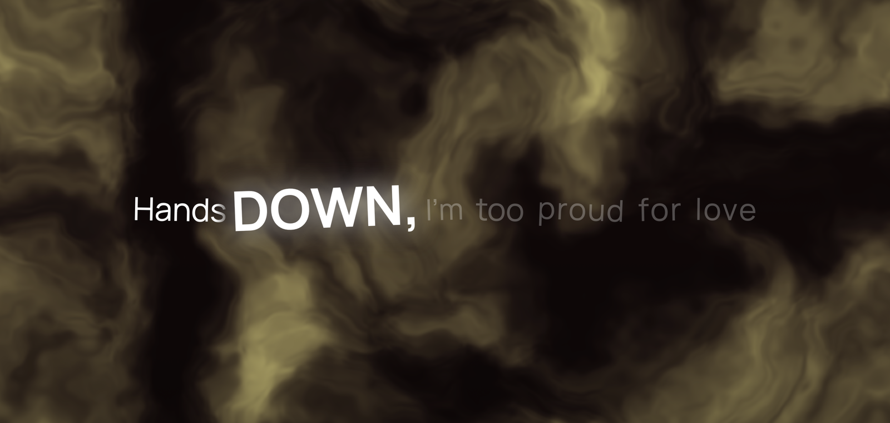
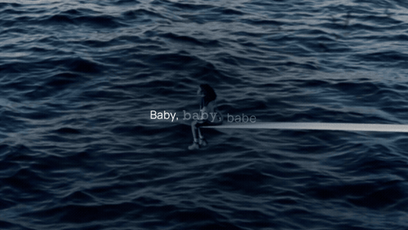
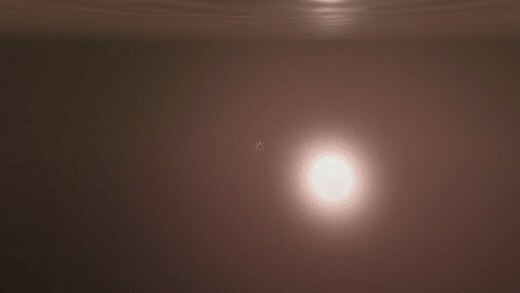
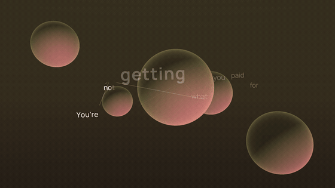
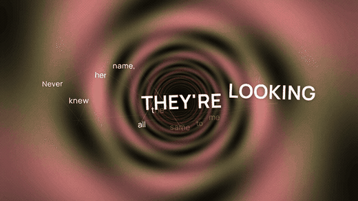
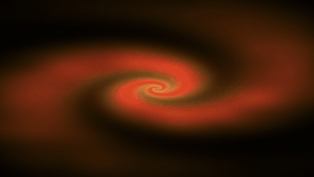
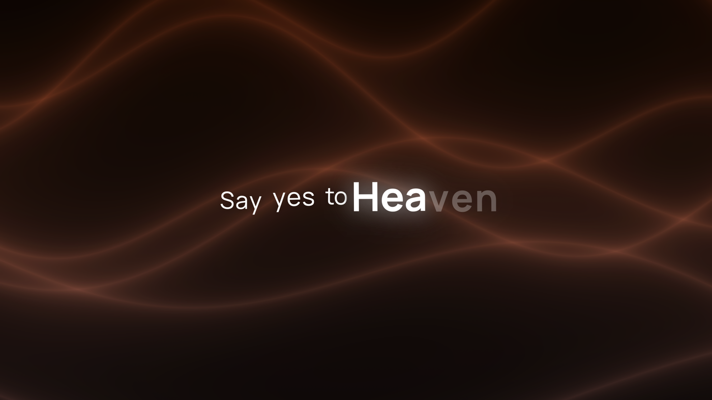
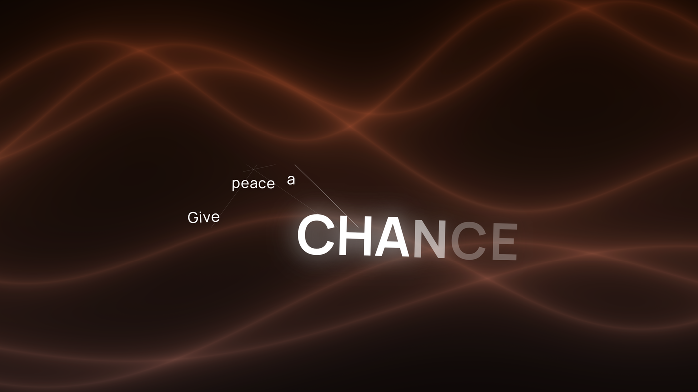
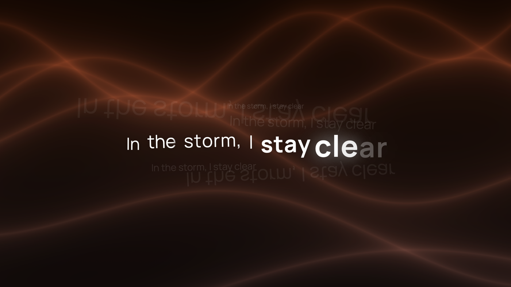
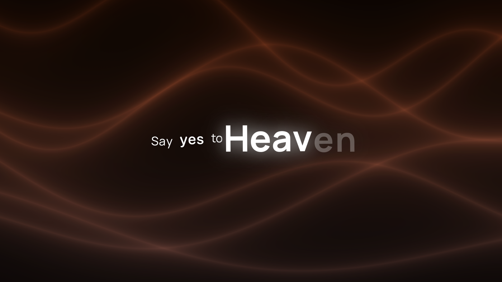

<p align="center">
  
</p>

<h1 align="center">Verso — Live Lyrics for your macOS Desktop</h1>

<p align="center">
  <a href="https://github.com/AkkiCode06/verso/stargazers"></a>
  <a href="https://github.com/AkkiCode06/verso/network/members"></a>
  <a href="https://github.com/AkkiCode06/verso/releases"></a>
  <a href="LICENSE"></a>
  <a href="https://github.com/AkkiCode06/verso/releases/latest"></a>
</p>

Verso turns your desktop wallpaper into a live lyric display. It reads what
Apple Music is playing and sets the words across your screen **as they are
sung** — word by word, not line by line — over GPU effects drawn in colours
pulled from the album cover. There is no window; it lives in the menu bar and
draws straight onto the desktop, underneath your icons.

Inspired by the [Cotodama Lyric Speaker](https://lyric-speaker.com/).

> [!NOTE]
> **Apple Music only, for now.** Verso reads playback through Music's
> public AppleScript dictionary. Spotify exposes no equivalent interface on
> macOS, so it is not supported yet — see [Roadmap](#roadmap).

---

## Highlights

* **Word-level sync** — each word lights as it is sung, with a karaoke sweep across the glyphs, and held notes swell letter by letter.
* **Emphasis from the performance** — which words are set large comes from how long each is *held*, measured against that line's own average, so a rap verse and a ballad are judged on their own terms.
* **Apple Music animated covers** — when an album ships one, it becomes the background. See below.
* **25 GPU effects** in Metal, tinted from the artwork, most of them closed-form 3D.
* **Four compositions** — Scattered, Constellation, Echo, Editorial.
* **Automatic matching** — typeface, composition and background all chosen from the track's own character, or pinned by you.
* **Any Google Font**, downloaded and registered at runtime, whole catalogue previewable.

## Other Features

* Live preview in Settings that renders through the same view the wallpaper uses.
* Cost tiers per effect, so battery and Low Power Mode narrow to the cheap ones rather than dropping effects entirely.
* Per-composition advanced controls — scatter, echo strength, effect speed, beat response, scrim, vividness.
* Launch at login, multi-display support, and a configurable fallback when a track has no lyrics.
* Menu bar panel with transport controls and a seek slider.

---

## Apple Music animated covers

<p align="center"></p>

A growing number of Apple Music albums ship an **animated cover** — a short
looping video the artist supplied alongside the square artwork. Verso
fetches it and promotes it to the full background.

* **The album's art direction wins.** When motion artwork exists, every generated effect steps aside — no shader, no pattern, no colour field competing with it.
* **Only the readability layer stays**, a light blur and scrim so the lyrics survive a bright frame. Both are adjustable in Settings → Background → Advanced.
* **Lyrics keep their timing and composition** on top, exactly as over any other background.
* **Falls back silently.** Most albums have no motion cover; those simply get a GPU effect instead, with a crossfade between the two.

<sub>Above: <i>SOS</i> by SZA. Motion artwork is Apple's asset, delivered by Apple, and is only ever displayed — never downloaded, cached or redistributed.</sub>

---

## The backgrounds move

Twenty-five effects, every one written in Metal. Most are **closed-form 3D** — a
plane or sphere solved analytically rather than a distance field marched step by
step, which is what keeps real depth affordable on an integrated GPU.

<table>
  <tr>
    <td width="50%"></td>
    <td width="50%"></td>
  </tr>
  <tr>
    <td align="center"><b>Ripple</b><br><sub>Interfering wave trains, Fresnel water, sun glitter</sub></td>
    <td align="center"><b>Orbit</b><br><sub>Real spheres — ray/sphere intersection, real silhouettes</sub></td>
  </tr>
  <tr>
    <td width="50%"></td>
    <td width="50%"></td>
  </tr>
  <tr>
    <td align="center"><b>Wormhole</b><br><sub>Inverse-radial projection, twisting with depth</sub></td>
    <td align="center"><b>Galaxy</b><br><sub>Logarithmic spiral arms seen at a tilt</sub></td>
  </tr>
</table>

<sub>Plus plasma, aurora, nebula, voronoi, silk, marble, kaleidoscope, fractal, waves, helix, mirror, prism, rings, vortex, bubbles, clouds, curtains, ribbons and strata.</sub>

## Four compositions

<table>
  <tr>
    <td width="50%"></td>
    <td width="50%"></td>
  </tr>
  <tr>
    <td align="center"><b>Scattered</b><br><sub>Words set loose across the line</sub></td>
    <td align="center"><b>Constellation</b><br><sub>Fragments linked by hairlines, like a star chart</sub></td>
  </tr>
  <tr>
    <td width="50%"></td>
    <td width="50%"></td>
  </tr>
  <tr>
    <td align="center"><b>Echo</b><br><sub>The phrase repeated at many sizes, some mirrored</sub></td>
    <td align="center"><b>Editorial</b><br><sub>Two typefaces in one line, set like a spread</sub></td>
  </tr>
</table>

---

## Requirements

* macOS 14.0 Sonoma or later.
* Apple silicon. Intel is untested.
* **Apple Music** — the app, playing locally. Streaming and library tracks both work.
* Xcode 15+ and XcodeGen to build from source.
* Permission: Automation (Music). Requested on first launch.

## Installation

1. Download the latest DMG [here](https://github.com/AkkiCode06/verso/releases/latest).
2. Open the DMG and drag Verso into Applications.
3. **Right-click Verso → Open**, then **Open** again. Not a double-click — see below.
4. Grant permission to control Music when asked.

> [!IMPORTANT]
> ### "Apple could not verify Verso is free of malware"
>
> **Expected, and not a statement about this app.** macOS shows that for *every*
> application not signed with a paid Apple Developer certificate — **$99 a
> year**. Verso is free, so it isn't signed. The warning means *"Apple has
> not been paid to vouch for this"*, not *"this software is dangerous"*.
>
> | | |
> |---|---|
> | **Easiest** | **Right-click** Verso in Applications → **Open** → **Open**. Once only. |
> | **No Open option?** | **System Settings → Privacy & Security** → scroll to **Security** → **"Open Anyway"**. |
> | **Terminal** | `xattr -dr com.apple.quarantine /Applications/Verso.app` |

## Quick Start

* Play something in Apple Music. The wallpaper takes over within a second or two.
* Click the waveform in the menu bar for transport controls, a seek slider, and Settings.
* Everything defaults to **Match the music** — leave it alone and each track picks its own look.
* Hover the desktop to dim the lyrics when you need to read what is behind them.

## Settings

* **Typeface** — Manrope by default, four genre-mapped faces, or any Google Font.
* **Composition** — how a line is arranged, with a live preview and per-composition advanced controls.
* **Background** — pin an effect or let the track choose; Advanced holds speed, beat response, scrim, vividness and motion blur.
* **Behaviour** — launch at login, what to do when a track has no lyrics, and how far to ease off the GPU on battery or in Low Power Mode.

## Troubleshooting

* **Nothing appears** — check Music is actually playing, and that Verso has Automation permission in System Settings → Privacy & Security → Automation.
* **"No lyrics found"** — the track has none at any provider. Instrumentals and very new releases are the usual cases; Settings → Behaviour changes what is shown instead.
* **Lyrics drift out of time** — Verso re-anchors every two seconds and leads by 160ms. A track seeked repeatedly may take a moment to settle.
* **Fans spinning up** — set Settings → Behaviour → on battery to *Only inexpensive effects*, or pin a light effect such as Ripple, Silk or Aurora.
* **Nothing after an update** — quit from the menu bar and relaunch; the wallpaper windows are rebuilt at launch.

---

## How it works

Some of this is more interesting than it needed to be, because macOS closes off the obvious routes.

<details>
<summary><b>There is no audio to analyse</b></summary>
<br>

A visualiser wants a spectrum. macOS gives no application access to another
app's audio stream, and `MediaRemote` — the private framework that used to
report now-playing state — has been gated behind an entitlement check in
`mediaremoted` since **macOS 15.4**. Both doors are shut.

So Verso reads Music through its public AppleScript dictionary, and takes
everything else from the lyric timeline.

</details>

<details>
<summary><b>Tempo, recovered from the words</b></summary>
<br>

Music reports `bpm` as **0** for streamed tracks — verified, not assumed — so
the tag is no help for the case that matters.

But sung words land on or near the beat far more often than not. Take the gaps
between word onsets, take the **median** (held notes and long rests are
outliers, and they move a mean but not a middle), then fold that into 70–170bpm.
The result is a beat period good enough to keep time by, and unlike the onsets
themselves it keeps ticking through intros, solos and run-outs.

</details>

<details>
<summary><b>Never multiply absolute time by a changing rate</b></summary>
<br>

The clock behind every effect integrates:

```swift
phase += dt * rate
```

The obvious alternative, `t * rate`, looks fine until the rate moves.
`timeIntervalSinceReferenceDate` is around **7.9 × 10⁸**, so nudging the
multiplier by a few percent shifts the result by *millions of seconds* and the
pattern teleports to an unrelated point in its cycle. Speeding the visuals up on
a beat read as the animation resetting.

Integrating makes rate a true velocity: changing it alters speed while position
stays continuous.

</details>

<details>
<summary><b>Closed-form 3D instead of raymarching</b></summary>
<br>

The first pass at 3D marched signed-distance fields — up to 90 steps per pixel,
plus six more field evaluations to estimate each surface normal. On an
integrated GPU driving a Retina display, that is the difference between idling
and running the fans.

Most 3D effects now intersect a plane or sphere in **closed form**: one solve,
and the normal falls out of the algebra rather than costing six extra samples.
Measured on an M-series MacBook against a 39% idle baseline:

| Effect | GPU load over idle |
|---|---|
| Helix *(raymarched)* | **+59** |
| Waves *(raymarched)* | +31 |
| Dunes *(closed-form)* | +14 |
| **Ripple** *(closed-form)* | **+9** |

Same sense of space, a sixth of the cost.

</details>

<details>
<summary><b>Matching a track to a look</b></summary>
<br>

Every effect declares where it sits on three axes — **energy**, **density**
(busy effects fight the lyrics) and **organic** (0 = machine-made and geometric,
1 = played by hand). The track is described on the same three. Energy alone
can't tell techno from bluegrass at the same tempo; that is what the organic
axis is for.

The track then picks from the **four best-fitting** effects, seeded by title and
artist so a song always looks like itself. Not the single nearest — sweeping the
plausible mood space showed a handful of effects sit closest to almost every
point real music occupies, leaving **20 of 25 unreachable**. Four brings
coverage to 24 of 25 while every candidate is still a close match.

</details>

---

## Roadmap

* **Spotify support** — blocked on there being any public way to read playback position on macOS. Contributions with a viable approach very welcome.
* **Notarization**, so the Gatekeeper step above goes away.
* **Testing on macOS 14 and 15.** The app targets 14.0 and the compiler confirms every API it uses exists there, but it has only been run on 26 so far.
* **Intel** testing.
* More compositions and effects.

## Building from source

```bash
brew install xcodegen
git clone https://github.com/AkkiCode06/verso.git
cd verso
xcodegen generate
open Verso.xcodeproj
```

The `.xcodeproj` is generated and deliberately not committed — `project.yml` is
the source of truth. To build a distributable disk image: `./Scripts/release.sh`

```
Sources/
├─ Lyrics/      provider chain, timing model, musical dynamics
├─ NowPlaying/  AppleScript bridge to Music, artwork, motion covers
├─ UI/          lyric typography, compositions, Metal shaders
├─ Settings/    preferences, panes, onboarding, Google Fonts
└─ Desktop/     the wallpaper windows and menu bar panel
```

## Contributing

**Contributions are the whole point of this being open.** Especially welcome:

* **New Metal effects** — `Sources/UI/Shaders.metal`. Keep them cheap; see the cost tiers in `ShaderBackgroundView.swift`.
* **New compositions** — `Sources/UI/LyricComposition.swift`.
* **Lyric providers** — the chain in `Sources/Lyrics/` tries each in order.
* **Bugs**, especially anything misbehaving on Intel or older macOS.

## Privacy

**No analytics, no telemetry, no tracking.** Network requests are made for
exactly three things: lyric lookups (title, artist, album, duration), album
artwork from the iTunes Search API when Music has no local copy, and Google
Fonts when you pick one. Track metadata and playback position are read from
Music locally over AppleScript and never transmitted.

## Lyrics

Verso hosts no lyrics. It queries public providers in order and uses the
first that answers:

1. **[KPoe](https://github.com/Prjkt-La/lyricsplus)** — Apple's own syllable-level timings, the best source
2. **NetEase Cloud Music** — word-level `yrc` timings
3. **[LRCLIB](https://lrclib.net/)** — line-level synced lyrics
4. **LRCLIB plain** — unsynced text as a last resort

**Lyrics are copyrighted works.** These services are free to query, which is not
the same as the words being unlicensed. Verso displays them on your own
machine for personal use, the way any lyrics app does, and stores nothing.

## License

Verso is released under the **GPL-3.0 License with Commons Clause**. Refer
to [LICENSE](LICENSE) for the full terms.

Free to use, study, modify and share. **You may not sell it** — the Commons
Clause removes that right specifically. Contributions welcome; profiting off
someone else's work is not.

## Acknowledgments

Verso builds on the work of several open-source projects and draws
inspiration from a piece of hardware:

* **[Cotodama Lyric Speaker](https://lyric-speaker.com/)** — the entire concept. A speaker whose front face is a display that composes lyrics as they play. The four compositions here are an attempt at its typographic behaviour: the scattered setting, the linked constellation, the mirrored echo, and the editorial spread.
* **[KPoe / lyricsplus](https://github.com/Prjkt-La/lyricsplus)** — syllable-level lyric timings sourced from Apple, the primary provider and the reason word-level sync is possible at all.
* **[LRCLIB](https://lrclib.net/)** — open, unauthenticated line-level synced lyrics, used as fallback.
* **NetEase Cloud Music** — `yrc` word-level timings, the second provider in the chain.
* **[Google Fonts](https://fonts.google.com/)** — the runtime font catalogue, and Manrope as the shipped default.
* **[XcodeGen](https://github.com/yonaskolb/XcodeGen)** — project generation from `project.yml`.
* **Morisawa Role** — the Lyric Speaker's own super-family. A commercial licence that cannot be shipped here, so each of its four roles is carried by the closest available face: Avenir Next Condensed, Charter, Rockwell and SF Rounded.

Not affiliated with or endorsed by Cotodama or Apple. Apple Music, Apple silicon
and macOS are trademarks of Apple Inc.
